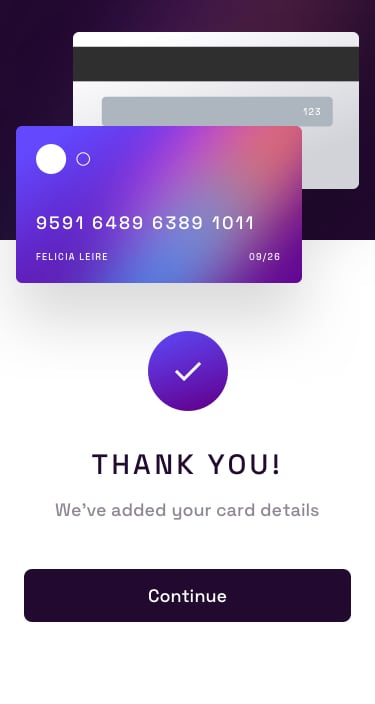

# Interactive-Card-Details-Form

## [Design(Figma)](https://www.figma.com/file/tghNo2lZaUyBeM3NUWIpBS/interactive-card-details-form?type=design&node-id=0-361&t=5jmioPGoKa3SyqFc-0)

## [Live URL](https://interactive-card-details-sable.vercel.app)

## Technologies Used

- Vite
- React
- TypeScript
- Styled Components
- Yup
- Formik
- Framer Motion
- React-Confetti

## Getting Started

To get a local copy of the project up and running, follow these steps:

1.  Clone the repository:

    ```shell
    git clone https://github.com/your-username/project-name.git
    ```

2.  Install the dependencies:

    ```shell
    cd project-name
    npm install
    ```

## Design Preview





